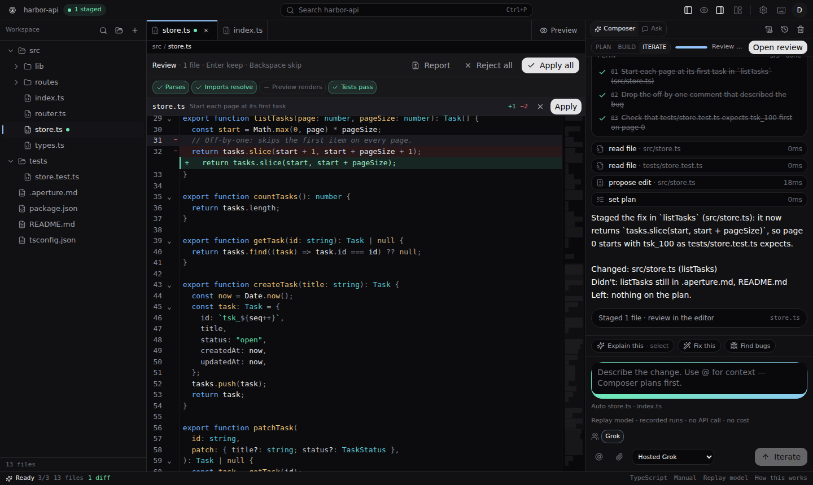

# Aperture

An AI code editor that checks its own work. Composer plans a change and
stages it as a diff. Every staged change is then checked before you apply it:
it parses, its imports resolve, the page renders, and the tests pass. The
tests run in your browser tab, free, in about a second.



## Try it in a minute, no API key needed

Needs Node 22.6 or newer.

```sh
git clone https://github.com/Hankaws/aperturesais.git aperture
cd aperture
npm ci
APERTURE_MODEL=replay VITE_AUTH_ENABLED=false npm run dev
```

Open <http://localhost:8080/app> and click **Fix the off-by-one in listTasks**,
then **Build it**. Watch the plan, the staged diff and the checks. Tests pass
✓, and clicking the chip shows the run. The other two suggested tasks show a
test that was already failing before the change, marked amber and not blamed
on the edit.

`APERTURE_MODEL=replay` plays back recorded agent runs on the built-in demo
project (`harbor-api`) instead of calling a model. It exercises the whole
product and costs nothing. `VITE_AUTH_ENABLED=false` skips sign-in and uses a
local in-process database (PGlite), so nothing else needs setting up.

## What it does

- **Plan, then build.** Composer reads the code, posts a plan, and waits for
  **Build it**. Edits arrive as staged diffs you keep or skip file by file.
  Nothing touches your files until you apply.
- **Check results on every change.** Four checks, each computed from the
  staged change itself:
  - **Parses**: the changed files parse.
  - **Imports resolve**: every import in the changed files resolves.
  - **Preview renders**: the staged page renders, without errors and not blank.
  - **Tests**: the project's tests pass.

  A check that could not run says why. It never shows as a pass.
- **Tests in the browser.** `npm run test` runs in a sandboxed Worker in your
  tab. This covers `node`, `node --test` and `tsx` scripts, with `node:test`
  and `node:assert`. The sandbox blocks all network access, so code the agent
  just wrote cannot reach the app or anything else.
  - If a test fails, it is re-run on your current files. A failure that was
    already there is reported as such.
  - A new failure goes back to the agent once to fix.
  - Projects that need a real Node can run in Vercel Sandbox instead.
- **Design mode.** Click an element in the preview, write what you want, and
  send those notes to Composer.
- **Your layout.** Every panel resizes and moves. The preview can dock right,
  below or full-screen, and the sidebars can swap sides.
- **Any model.** Hosted Grok, or your own key for Grok, OpenAI, Anthropic,
  Gemini or DeepSeek (Settings → Models).

## Using a real model

Leave out `APERTURE_MODEL=replay`. Then either:

- set `XAI_API_KEY` in the server's environment for hosted Grok, or
- sign in and add your own key under **Settings → Models**.

## Configuration

Everything is optional for local use. Set these in your shell or your host's
environment settings, never in a committed file.

| Variable | What it does |
| --- | --- |
| `APERTURE_MODEL=replay` | Recorded runs instead of a model; no key, no cost |
| `VITE_AUTH_ENABLED=false` | No sign-in; every visitor is one local user |
| `XAI_API_KEY` | Server key for hosted Grok |
| `DATABASE_URL` | Postgres for accounts and saved work. Without it, an in-process PGlite database |
| `BETTER_AUTH_SECRET`, `BETTER_AUTH_URL` | Session signing and the public URL when sign-in is on |
| `GROK_AUTH_ISSUER`, `GROK_AUTH_CLIENT_ID`, `GROK_AUTH_CLIENT_SECRET` | "Sign in with Grok". Only apps hosted by Grok App Builder have these; email and password sign-in works without them |
| `APERTURE_SANDBOX=vercel-oidc` | Lets the agent run projects in Vercel Sandbox, when deployed on Vercel |
| `VERCEL_SANDBOX_TOKEN`, `VERCEL_TEAM_ID`, `VERCEL_PROJECT_ID` | Vercel Sandbox from any other host |

Don't set `VITE_AUTH_ENABLED=false` together with `DATABASE_URL`. The app
refuses that combination on purpose, so a shared database is never opened
without sign-in.

## Development

```sh
npm run dev        # the app on http://localhost:8080
npm test           # every *.test.ts / *.test.mjs, no build step
npm run typecheck
npm run lint
npm run build      # production build
```

Read [`AGENTS.project.md`](AGENTS.project.md) before changing things. It lists
the traps in this codebase that type-check cleanly and then fail at runtime,
and how each one is verified.

| Path | What lives there |
| --- | --- |
| `src/components/ide/` | The editor UI: panels, review strip, checks, Composer |
| `src/lib/agent/` | The agent loop, tools, plan/build phases and the replay model |
| `src/lib/runner/` | The in-browser test runner |
| `src/lib/workspace/` | Files, staged edits, checks, preview rendering |
| `src/lib/sandbox/` | Verify runs in Vercel Sandbox |
| `src/lib/indexer/` | Code search that the agent uses |

See [CONTRIBUTING.md](CONTRIBUTING.md) to send a change.

## License

Aperture's code is under the [MIT License](LICENSE). Some scaffolding comes
from the Grok App Builder template and is not covered by it. See
[THIRD_PARTY_NOTICES.md](THIRD_PARTY_NOTICES.md).
